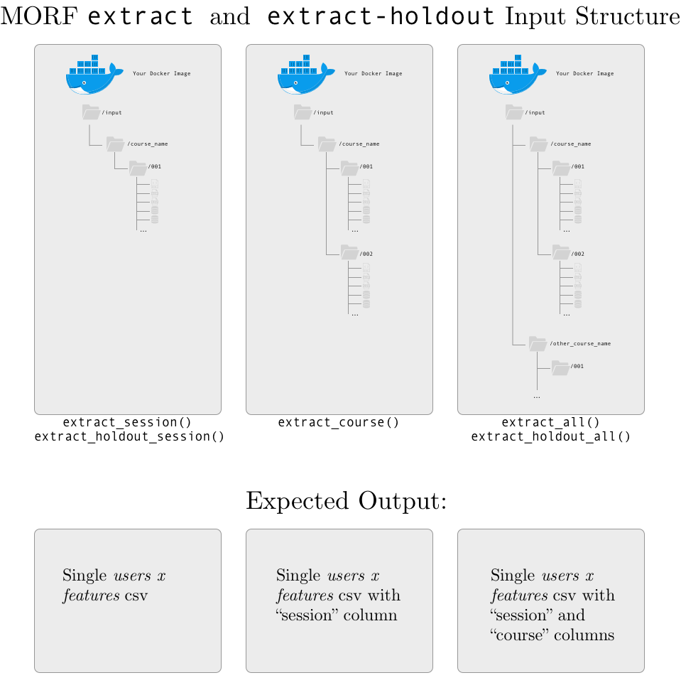
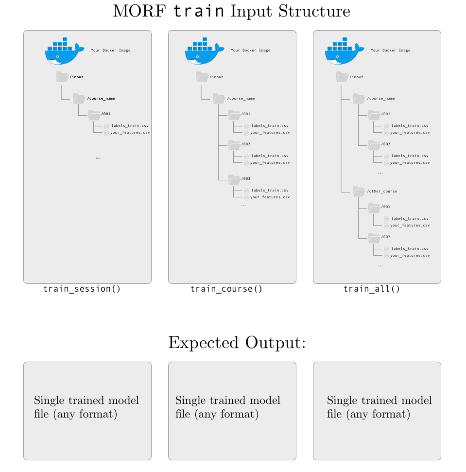
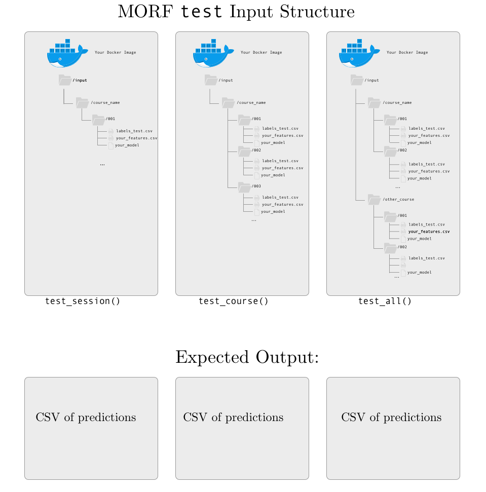
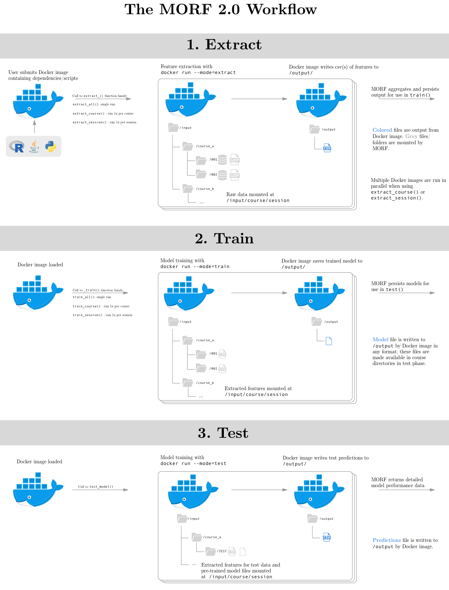

# Documentation 
{:.no_toc}

* Will be replaced with the ToC, excluding the "Contents" header
{:toc}

# MORF 2.0 API

This document describes available functions for predictive model training and testing in the MOOC Replication Framework (MORF) version 2.0. If you're new to MORF, this is the first document you should read.

# Introduction 

The MORF API is used to construct and evaluate predictive models from raw MOOC platform data. The main steps to executing a job on MORF are:

1. Write code to extract features from raw platform data and build predictive models on the results of that feature extraction.
2. Write a high-level "controller script" using the MORF Python API.
3. Build a Docker image containing your code and any software dependencies with the appropriate control flow.
4. Create a configuration file containing identifiers and links to your controller script and docker image.
5. Upload the the controller script, docker image, and configuration file to public locations (you need to provide either HTTPS or S3 URLs to these files).
6. Submit your job to the MORF web API. You will receive notifications and results via email as your job is queued, initiated, and completed.

To execute a complete example on MORF which extracts features from course clickstream data, trains a predictive model using logistic regression, and evaluates its dropout predictions, see the examples in  the [github repository](https://github.com/jpgard/morf) and the instruction on the [getting started](https://jpgard.github.io/morf/getting-started/) page.

# API Overview

MORF provides different API functions based on the way your modeling pipeline uses data. In particular, we provide multiple APIs for the `extract` and `train` steps of model-building. These functions are documented below, but each works in fundamentally the same way: the raw MORF data is mounted into a root-level `/input/` volume of the image along with the user-provided Docker image, and the Docker image is iteratively called using the `docker run` command with a `--mode` parameter specifying whether that image should `extract`, `train`, or `test`.

## Feature Extraction

Three types of API functions are available for feature extraction. These functions are used to specify whether the user-provided Docker image extracts features 

+ once per *session* (those ending in `_session()`), 
+ once per *course* (those ending in `_course()`),
+ once for all courses collectively (`_all()`)

Similar `extract_holdout` functions are used to specify how to extract features from holdout (test) data.

| Function name            | Description                    |
| ------------------------ | ------------------------------ |
| `extract_all()`       | Extracts features using the docker image across all courses and all sessions except holdout. If this function is used, the Docker image should iterate over the course- and session-level directory structure mounted in `/input/` and return a single *person* x *features* x *course* x *session* array. |
| `extract_course()` | Extracts features using the Docker image, building individual feature sets for each course. If this function is used, the Docker image should iterate over the session-level directory structure mounted in `/input/` and return a *person* x *features* x *session* array. The Docker image will be run once per course. This allows parallelization of feature extraction over courses. |
| `extract_session()` | Extracts features using the Docker image, building individual feature sets for each 'session' or iteration of the course. If this function is used, the Docker image should read data from the individual session directory structure mounted in `/input/` and return a *person* x *feature* array. The Docker image will be run once per session. This allows parallelization of feature extraction over sessions, and achieves the highest level of parallelization. We expect most users will utilize this function, unless normalization across courses or the entire dataset is necessary.|
| `extract_holdout_all()` | Extracts features using the Docker image across all courses and all sessions of holdout data.|
| `extract_holdout_session()` | Extracts features using the Docker image across each session of holdout data.|

To further clarify: the `extract_` function family determines how MORF runs your Docker image, and what data is mounted in the `/input/` directory each time that image is `run`. 

+ If `extract_all()` is used, the data for all runs of all courses is mounted to `/input/`, and the Docker image is `run` a single time. The Docker image is expected to write a single .csv file to `/output/` with a set of features for every user of every session of every course. The CSV should contain columns for 'course', 'session', and 'user'.
+ If `extract_course()` is used, data for an individual course is mounted to `/input/`, and the Docker image is `run` once for each course. The Docker image is expected to write a single .csv file to `/output/` with a set of features for every user for every session of the course. The CSV should contain columns for both 'session' and 'user'. MORF will aggregate and persist the features for each course internally (all your image needs to do is write them to the `/output` directory).
+ If `extract_session()` is used, data for an individual session of a course is mounted to `/input/`, and the Docker image is `run` once for each session of each course The Docker image is expected to write a single .csv file to `/output/` with a set of features for every user in that session. MORF will aggregate and persist the features for each session internally (all your image needs to do is write them to the `/output` directory).

Note that there is no `extract_holdout_course()` function because there is only one session per course; this would be equivalent to using `extract_holdout_session()`.

All feature extraction functions expect the Docker image to write individual `.csv` files to `/output` at the level of aggregation of the `extract` function used: `extract_all()` should write a a single *user x feature* .csv file to `/output/`; `extract_course()` should write one *user x feature* .csv array for each course; `extract_session()` should write one *user x feature* .csv array for each session of each course.

The complete specifications for the `/input/` directory structure are in shown in the input-output documentation below. The full set of `docker run` parameters used to call the image are demonstrated in the docker section below.

If your workflow does not conform to the expected input/output protocol, no data will be returned and the job will be cancelled.

## Model Training

Three types of API functions are also available for model training. Identical to the feature extraction options, these functions are used to specify whether the user-provided Docker image trains one model per *session* (`train_model(session)`), once per *course* (`train_model(course)`), or once overall for the entire MORF 2.0 dataset (`train_model()`). These can be used regardless of how feature extraction was conducted.

| Function name            | Description                    |
| ------------------------ | ------------------------------ |
| `train_all()` | Trains a single overall model using the entire dataset using the Docker image. Features for each session of the course will be aggregated (if not aggregated already) and provided in a single *person* x *feature* array to train the model.|
| `train_course()` | Trains one model per course using the Docker image. Features for each session of the course will be aggregated (if not aggregated already) and provided in a single person x feature x session] array to train the model.|
| `train_session()` | Trains one model per session of the course using the Docker image.|


Your code is expected to output one file at the level of aggregation of the `train` function used (if you use `train_course()`, your code should write one file per course in `\output`). This file should contain any elements of your trained model that will be needed for prediction on new data in the `test` step. The type of file is arbitrary (it can be any file type) and should match the type of file your Docker image expects as input in `test` mode.

## Model Testing

To test your models, MORF applies the trained models to the features extracted from the holdout session of each course, using the features extracted in the `extract-holdout` step. 

Note that while there are several options for feature extraction and predictive model construction, there is only one method available for predictive model evaluation. This is because no matter how models are constructed, they are evaluated on held-out runs of the same courses used for training. No matter whether models are trained at the session, course, or overall level, they will be used to predict on features from the held-out datasets extracted using the method specified above, and these performance results are aggregated and returned to you. For more information on why MORF uses this prediction architecture, see the MORF software paper in [publications](https://jpgard.github.io/morf/publications/).

| Function name            | Description                    |
| ------------------------ | ------------------------------ |
| `test_all()`  | Tests a single model on all courses. This should be the testing function used with `extract_holdout_all()`.|
| `test_course()`  | Tests a model for each course individually. This should be the testing function used with `extract_holdout_session()`.|

Your code is expected to write individual `.csv` files to `/output` at the level of aggregation of the `extract_holdout` function used. This file should have three columns: `userid` (the first column), `pred` (the predicted label), and `prob` (the probability of this label). The first row of the file should contain the column names. 

## Model Evaluation

Once you have completed the `extract`, `train`, and `test` phases of an experiment, MORF evaluates the model according to a wide variety of outcome metrics. Currently, the only type of evaluation is at the per-course level, so these metrics are provided for each course in the MORF dataset.

| Function name            | Description                    |
| ------------------------ | ------------------------------ |
| `evaluate_course()`  | Evaluates predicted class labels and probabilities for each course. Generates detailed performance statistics for each course, which are sent to the user via email immediately after job completion on MORF.|

To see a complete example of the output of MORF's model evaluation, try running the example code in the [getting started](https://jpgard.github.io/morf/getting-started/) section. If you'd like to use an additional outcome metric for your experiment that is currently not included in MORF's output, please contact us at morf-info@umich.edu.

# MORF input-output contract

MORF's predictive modeling API places some minimal, but strict, restrictions on the output format for each step of a predictive modeling job (`extract`, `extract-holdout`, `train`, and `test`.) This page documents these restrictions, which exist for security and ease of platform use. MORF predictive modeling jobs must conform to these restrictions exactly, or risk cancellation of jobs due to errors.

This document is organized by `mode`. Your Docker container should expect different input formats, and write different output formats, depending on the `mode` of the job.

Each section describes the INPUT, the files that will be mounted in the `/input/` directory for jobs in that mode; and the OUTPUT, the file that your script should produce in the `/output/` directory (there should only be one output file, regardless of mode).

MORF utilizes a consistent *input/output contract* for each family of functions (i.e., for a family of functions with the suffix `_session`, `_course`, or `_all`): 

+ the *input* directory structure is consistent, always located at `/input`. Raw data for every course is organized within directories `/input/course/session/` where `course` is a course name and `session` is a unique session id. Docker images should always expect this structure whenever input is used for the API functions (i.e., for `extract`, `train`, and `test` families).
+ the *output* structure is consistent. For feature extraction and model testing, output is generally expected to be a .csv file, one per iteration of extraction or testing. For model training, output can be any type of file, and should match the file type expected as input to your Docker image when called in `test` mode.


## Extract and Extract-Holdout

INPUT: course directories, containing session subdirectories, which each contain the complete set of [raw data exports](https://spark-public.s3.amazonaws.com/mooc/data_exports.pdf) for a course. As shown below, the exact data that is expected depends on the MORF API function you use:

+ If you use *session-level* extraction, your script should output a unique data file for each session; 
+ If you use *course-level* extraction, your script should output a unique data file for each course (with a column named `session` that indicates the session of the course); 
+ If you use *all-level* extraction, your scruot should output a single data file for all of the data (with a column named `session` that indicates the session of the course, and a column named `course` that indicates the course).

Session numbers and course names should exactly match the names in the course- and session-level directories.



In addition, we provide a file called `coursera_course_dates.csv` in each session-level directory. This file contains the start and end date of each course; a sample (with fake course names) is shown below:

``` 
course,fullname,start_date,end_date
somecourse-001,Some Course: An Introduction to Topic,2/2/15,4/13/15
somecourse-002,Some Course: An Introduction to Topic,6/1/15,8/6/15
somecourse-003,Some Course: An Introduction to Topic,10/5/15,12/21/15
othercourse-001,Another Course: Advanced Applications,10/6/14,11/21/14
othercourse-002,Another Course: Advanced Applications,2/2/15,4/13/15
othercourse-003,Another Course: Advanced Applications,2/2/15,3/13/15
othercourse-004,Another Course: Advanced Applications,5/4/15,7/15/15
```

This file is intended to easily provide the official start and end dates that a course opened and closed to learners, for calculating information related to course weeks or course duration.

### Extract-Holdout

`extract-holdout` follows a workflow nearly identical to `extract`. There is no `extract_course()` function because there is only one session per course (the last session) that is used for holdout/model testing in MORF.

## Train

INPUT: a csv file with labels named `labels-train.csv` and a csv file with your extracted features with the name your script gave it during the `extract` phase. Each set of features and labels is mounted in a session-level directory for consistency, regardless of the API function used.

OUTPUT: a single model file, in any format. There are no current restrictions on the size, name, or format of the model, except that it should be a single file. If your model requires multiple files, try zipping them before saving to the `output/` directory.




## Test

INPUT: a csv file with labels named `labels-test.csv` and a csv file with your extracted features with the name your script gave it during the `extract-holdout` phase. Each set of features and labels is mounted in a session-level directory for consistency, regardless of the API function used.

OUTPUT: a csv file of predictions. Currently, MORF requires a csv file with the following format:

``` 
userID,prob,pred
577565faad64aee5941e5cfe0bfb771f494ef38c,0.854974830451673,1
3a123c4b417a4d2581705bd1745b733e49044a88,0.854974830451673,1
af74b2124ed39c35ae4bd172d77f8925c05bee7d,0.854974830451673,1
92d4d4d8f7d8d11b7c8dc6035aa9daf027cc7b13,0.854974830451673,1
7c14ee25f4484a92656201a336f45e8c61ff30d1,0.854974830451673,1
083f2a394144d0ce95d0c4fb4fbbd12c16f2bf86,0.854974830451673,1
6ce838c981b18de252e987c263bb78292e628fd0,0.854974830451673,1
0ec50cd0bf925830789241daa7529a5d00f481de,0.854974830451673,1
```

`userID` is the session user ID; `prob` is the predicted probability of being in the positive class (required for many model evlauation metrics, such as AUC and log loss); `pred` is the predicted class label (for dropout prediction, this should be 0 or 1).



# Using Docker with MORF

Docker is the containerization service that allows MORF to be flexible and accept code run in any language. This section describes some Docker basics for using the MORF platform, including creating Dockerfiles and building images from Dockerfiles. It also gives some additional information on how MORF runs Docker images internally and what command line arguments any submitted Docker image needs to accept.

This tutorial assumes that you have Docker installed. For more information about Docker, including installation instructions, see [Docker installation instructions](https://docs.docker.com/engine/installation/) and [Getting Started with Docker](https://docs.docker.com/get-started/).

## Docker Image environment

The Docker image you provide will be run in a non-networked environment with `/input/` and `/output/` directories mounted in its filesystem.

Your Docker image will be called with a `--mode` flag, which is used to trigger the appropriate action based on the input that will be mounted in its filesystem. These `mode`s are:

+ `--mode=extract`: Raw course data will be mounted in `/input/` directory; feature extraction expected according to input/output contract described above.
+ `--mode=train`: Extracted data from training runs will be mounted in `/input/` directory; model training expected according to input/output contract.
+ `--mode=test`: Extracted data from testing runs will be mounted in `/input/` directory; model testing/prediction expected according to input/output contract.


## Creating a Project Dockerfile

A Dockerfile is a text file that contains instructions for building your Docker image. The exact contents of this file depend on (a) the software dependencies of your MORF project code, which may include (for example) scripts written in Python, Java, R, or other languages; and (b) the actual code needed to run for your MORF workflow (feature extraction, training, and testing). You can create this file using any text editor; save it with no extension and name it `dockerfile`. Note that, because the Docker image does not have network access (for security reasons), any required libraries or software packages required by your code should be installed in the Docker image.

Here is an example of a simple Dockerfile (this file is also located at `mwe/dockerfile`):

```
# Pull base image.
FROM ubuntu:16.04

# install Python 
RUN \
  apt-get update && \
  apt-get install -y sudo software-properties-common python-software-properties && \
  apt-get -y install python3-dev python3-pip python-virtualenv && \ 
  rm -rf /var/lib/apt/lists/* 

# install Python libraries
RUN pip3 install numpy pandas

# install r and dependencies
RUN \
  sh -c 'echo "deb http://cran.rstudio.com/bin/linux/ubuntu xenial/" >> /etc/apt/sources.list' && \
  gpg --keyserver hkp://keyserver.ubuntu.com:80 --recv-key E084DAB9 && \
  gpg -a --export E084DAB9 | apt-key add - && \
  apt-get update && \
  apt-get -y install r-base && \
  R -e "install.packages('getopt', repos = c('http://cran.rstudio.com/','http://cran.us.r-project.org'), dependencies = c('Depends'))" && \
  R -e "install.packages('optparse', repos = c('http://cran.rstudio.com/','http://cran.us.r-project.org'), dependencies = c('Depends'))"


# install MySQL and add configurations
RUN echo "mysql-server-5.7 mysql-server/root_password password root" | sudo debconf-set-selections && \
  echo "mysql-server-5.7 mysql-server/root_password_again password root" | sudo debconf-set-selections && \
  apt-get -y install mysql-server-5.7 && \
  echo "secure-file-priv = \"\"" >>  /etc/mysql/mysql.conf.d/mysqld.cnf

# add scripts
ADD mwe.py mwe.py
ADD feature_extraction feature_extraction
ADD modeling modeling
# start mysql
RUN service mysql start

# define entrypoint
ENTRYPOINT ["python3", "mwe.py"]
```

This Dockerfile has seven distinct steps, and demonstrates a typical workflow for MORF which uses Python 3, R, and mySQL. Let's walk through each step.

#### (1) pull base image 
{:.no_toc}
```
FROM ubuntu:16.04
```

This command defines the base ubuntu 16.04 image to use as the first layer for building the Docker image. 

We recommend starting from one of Docker's base images unless the environment you need isn't available. Check the official Docker [library](https://github.com/docker-library/official-images/tree/master/library) for a list of available image tags.

#### (2) install Python 
{:.no_toc}
``` 
RUN \
  apt-get update && \
  apt-get install -y sudo software-properties-common python-software-properties && \
  apt-get -y install python3-dev python3-pip python-virtualenv && \ 
  rm -rf /var/lib/apt/lists/* 
```

This command uses the Docker keyword `RUN` to define commands that should be literally executed in the image. Note that each of these commands would normally by entered at an ubuntu command line prompt; Docker does this when building the image.

#### (3) install Python libraries
{:.no_toc}
``` 
RUN pip3 install numpy pandas
```

This line uses `pip` to install Python libraries that are used in the feature extraction and modeling code in `mwe`.

Note that Python and `pip` were installed in the previous step, which makes the use of `pip` available in this step (just as if it were installed on any machine).

#### (4) install r and dependencies
{:.no_toc}
``` 
RUN \
  sh -c 'echo "deb http://cran.rstudio.com/bin/linux/ubuntu xenial/" >> /etc/apt/sources.list' && \
  gpg --keyserver hkp://keyserver.ubuntu.com:80 --recv-key E084DAB9 && \
  gpg -a --export E084DAB9 | apt-key add - && \
  apt-get update && \
  apt-get -y install r-base && \
  R -e "install.packages('getopt', repos = c('http://cran.rstudio.com/','http://cran.us.r-project.org'), dependencies = c('Depends'))" && \
  R -e "install.packages('optparse', repos = c('http://cran.rstudio.com/','http://cran.us.r-project.org'), dependencies = c('Depends'))"
```

This command executes the ubuntu commands to install R for Ubuntu, and then installs some R packages used in the `mwe`. 

You may not be used to installing R packages via the command line, but this is required for building a Docker image for MORF -- you cannot install R libraries within your R scripts, for example, because the Docker image is run in a non-networked environment. Note that you can also install many independent libraries in a single line, but any dependencies need to be installed in a separate, prior call to `install.packages()` from the packages that depend on them.

#### (5) install MySQL and add configurations
{:.no_toc}
``` 
RUN echo "mysql-server-5.7 mysql-server/root_password password root" | sudo debconf-set-selections && \
  echo "mysql-server-5.7 mysql-server/root_password_again password root" | sudo debconf-set-selections && \
  apt-get -y install mysql-server-5.7 && \
  echo "secure-file-priv = \"\"" >>  /etc/mysql/mysql.conf.d/mysqld.cnf
```
This step installs mySQL, sets the root password, and sets the `secure-file-priv` option to allow for exporting of query results to a file (using mySQL's `INTO OUTFILE` command requires setting this option).

The database exports in MORF are provided as mySQL dumps, and accessing them requires mySQL. Jobs that do not use data from the mySQL dumps can skip this step.

#### (6) Add scripts and start mySQL
{:.no_toc}
``` 
# add scripts
ADD mwe.py mwe.py
ADD feature_extraction feature_extraction
ADD modeling modeling
# start mysql
RUN service mysql start
```

This step adds scripts and directories from the local directory to the dockerfile itself using the [docker run](https://docs.docker.com/engine/reference/run/) command and starts mySQL within the container. 

To see which scripts and directories are being added. look inside the directory containing the `dockerfile` in the `mwe` directory of the github repo. The scripts added here are used in the extract, train, and test workflow; `mwe.py` is a simple script that reads the input from the `docker run` command in MORF and uses it to control the flow of execution.

Any modules, code, or other files you want to be available inside your Docker image during execution must be added by using `ADD` in your dockerfile; no code can be downloaded or installed during execution.

#### (7) define entrypoint
{:.no_toc}

``` 
ENTRYPOINT ["python3", "mwe.py"]
```

This command uses Docker's `ENTRYPOINT` keyword to define an entrypoint for execution. 

Whenever this image is executed by MORF, this line tells the image to automatically execute `python3 mwe.py` instead of entering any other shell. Note that MORF will also pass the `--mode` flag used to control the script when calling your script, so whichever script is defined as the `ENTRYPOINT` should expect a command-line argument for `mode` which takes the values described below.

More information about `ENTRYPOINT` is in Docker's documentation [here](https://docs.docker.com/engine/reference/builder/#entrypoint).

## Building a Docker Image from a Dockerfile

Once you have created your Dockerfile, you need to `build` and `save` an image for use with MORF. `build`ing a docker image is as simple as opening a terminal window, navigating to the directory containing your Dockerfile, and running the command:

```
$ docker build -f dockerfile .
```

When this command completes (which may take several minutes, depending on the size and complexity of the environment it is building), you need to save the image to a .tar file. Using the image ID (this will be the final line from the output of `docker build`), save this image to a .tar archive by entering:

``` 
$ docker save d459f7d42902 > my-docker-image.tar
```

This will create a file `my-docker-image.tar` in the current working directory. This is the file you need to provide access to for MORF; ideally by uploading this file to S3 or an `https` location.

## MORF Environment Variables Passed To Your Image

MORF passes information to your Docker image in order to control the flow of the program. This information defines what data is mounted in the Docker image at runtime, and also tells the Docker image what task it needs to do (`extract` features from raw data; `train` a model from pre-extracted data; `test` a pre-trained model on pre-extracted data). This includes the following variables:

* `mode`: This is the most important parameter passed to your Docker image. Possible values of `mode` include `extract`, `extract-holdout`, `train`, `test`. In each of these modes, data is mounted in the `/input/` directory of your Docker image at runtime, and MORf expects the appropriate data to be written to `/output/` based on the `mode` and on your Docker API script.
* `course` this parameter provides a unique string identifying the course. In combination with `session`, this can be used to iterate over the course directory; data for any course and session is mounted at `/input/course/session`.
* `session` this parameter provides a unique 3-digit identifier for each session of each course (i.e., 001, 002, 011, etc.) Together with the `course` name, this parameter provides a unique path to a subdirectory containing the complete data for one session of a course, at `/input/course/session`.

You should use some kind of command-line parsing tool in your script to read these parameters; your script MUST use `mode`; the use of `course` and `session` is optional. For command-line parsing in Python, we recommend [argparse](https://docs.python.org/3/library/argparse.html); for command-line parsing in R, we recommend [optparse](https://cran.r-project.org/web/packages/optparse/index.html). You can find examples of both libraries in the `mwe` scripts.




## Debugging and Running Docker Interactively

Sometimes, it is useful to open your Docker .tar image interactively, either to debug, explore data, or just check that everything is working as expected.

The easiest way to explore your Docker image interactively is by using `docker run` with the `-it` flag. For example, once you have created your Dockerfile, built the image from this Dockerfile using `docker build`, and created a .tar archive using `docker save` (as described in previous steps), you then need to `load` the image:

``` 
$ docker load -i my-docker-image.tar
```

This will produce a SHA256 code for the image. Use that SHA256 code, and you can open your .tar file using the following command (replace `SHA256CODEHERE` with your code):

``` 
$ docker run -it --entrypoint=/bin/bash SHA256CODEHERE
```

Additionally, you can mount local directories of data to the `/input/` and `/output/` directories in your image using the `--volume` flag:

``` 
$ docker run -it --entrypoint=/bin/bash --volume=/some/path/to/local:/input --volume=/some/other/path:/output SHA256CODEHERE
```

This would open your Docker image with all of the contents of `/some/path/to/local` mounted at `/input` and `/some/other/path` mounted at `/output`, allowing you to mimic the directory structure used internally by MORF when executing your job.


